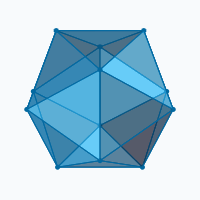

# OSINT & Blockchain Investigator
### AML / Financial-Crime Compliance · Enhanced Due Diligence · On-Chain Forensics

---

## What I do

I trace stolen and laundered crypto back to where it actually came from — and where it's actually going. I got into this because I couldn't stand watching people eat the loss while the money just disappeared, so every wallet, company, or vessel I flag comes with exactly how sure I am, and why. If the evidence doesn't get me to a name, I say so instead of guessing.

---

## 🗂️ Investigations & writeups

| Case | What I found | Evidence |
|---|---|---|
| **[Full TRON writeup](https://github.com/Kristina89-oss/tron-investigation-writeup)** | How a $72M Tether freeze unravelled into a 761-address network — written as it happened, mistakes included | Step-by-step |
| **[TRON/USDT laundering — $120M](https://github.com/Kristina89-oss/tron-laundering-investigation)** | A trail public reporting missed, plus a hidden $23.4M bridge to a second network | 647 addresses, FATF-scored |
| **[TRON phishing kit → USDT resale](https://github.com/Kristina89-oss/TRON-Phishing-Kit-and-USDT-Laundering-Network-)** | Fake refund site feeding a $125M+ resale storefront on Telegram | Chain of custody, SHA-256 |
| **["TGR Exchange" cash-out scam](https://github.com/Kristina89-oss/TGR-scam-exchange-case)** | Fund-flow trace to the ad campaign & hosting records | Every claim confidence-tagged |
| **Sanctions exposure — 21-vessel fleet** | Clean on every list — until I found the one contact name-screening can't see | Client work, no public repo |

---

## 🔎 Wallet check

A local, single-page tool I built for checking a wallet the way I would by hand — FATF-style red-flag scoring, sanctions/freeze/phishing-blocklist screening, mixer and cross-chain bridge tracing, an activity heatmap, and OSINT, all from one address or tx hash. Runs on `127.0.0.1`; nothing is sent anywhere except the read-only API calls it documents.

- 🚩 **FATF red flags** — mixer use, structuring, mule-style pass-through, abnormal counterparty fan-out
- 🧊 **Sanctions & freezes** — OFAC SDN, live/historical USDT blacklist, ScamSniffer phishing list
- 🌉 **Mixer & bridge tracing** — Tornado Cash interactions, a recursive cross-chain bridge tracer
- 🔎 **OSINT** — Chainabuse reports, GoPlus/SlowMist/BlockSec labels, RansomLook, web search

**[Repo →](https://github.com/Kristina89-oss/tracing-dashboard)**

---

## 🗄️ Databases

| Database | Covers | Scale |
|---|---|---|
| **[Arms trafficking: Türkiye → Europe](https://github.com/Kristina89-oss/Arms-trafficking-Turkiye-Europe)** | Turkish blank-firing pistols smuggled into Europe & converted to live weapons | 18 charts, customs/court sourced |
| **[Crime Networks Database](https://github.com/Kristina89-oss/Crime-networks-Database)** | Scandinavian (Foxtrot, Rumba) & Turkish-origin (Daltons, Baygaralar, Redkit) profiles | Source-tagged 🟢🟡🔴 |
| **[China–DRC Database](https://github.com/Kristina89-oss/China-DRC-Database)** | China's mining, cobalt, corruption & security footprint in the DRC | 51 companies, 19 charts |

---

## 🧭 Core competencies

| Area | Skills |
|---|---|
| Compliance & AML | EDD · KYC/CDD · SAR/STR Support · FATF Red Flags |
| Sanctions | OFAC SDN · EU/UK/UN Lists · Secondary/Derivative Risk |
| On-chain forensics | Fund-Flow Tracing · Tronscan · Etherscan · Arkham |
| OSINT | Corporate Registries · Shell-Entity Mapping · AIS Vessel Tracking |
| Data & automation | n8n Pipelines · Local LLM Parsing (Ollama) |

---

## 🛠️ Tools & sources

